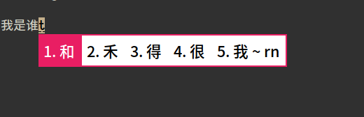
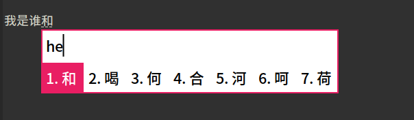

# 使用方式
```
mkdir -p ~/.local/share/fcitx5/themes/Material-Color
git clone https://github.com/hosxy/Material-Color.git ~/.local/share/fcitx5/themes/Material-Color
```

然后修改配置文件： `~/.config/fcitx5/conf/classicui.conf`

```
# 垂直候选列表
Vertical Candidate List=False

# 按屏幕 DPI 使用
PerScreenDPI=True

# Font (设置成你喜欢的字体)
Font="思源黑体 CN Medium 13"

# 主题
Theme=Material-Color
```

# 截图





图一是五笔，图二是拼音/双拼。我也不知道该如何统一风格，只能这样了，我个人的话比较喜欢图一的风格。<br>
这是我在fcitx5提的相关[issue](https://github.com/fcitx/fcitx5-chinese-addons/issues/3))

**Tips:我用的是粉红，主题里还有其他的颜色，不喜欢粉红的可以自己换。**
