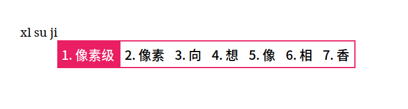
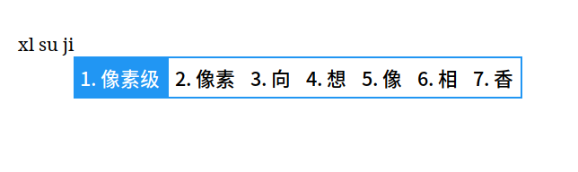
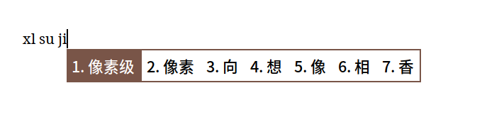
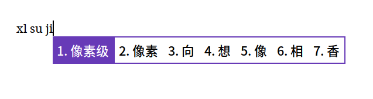
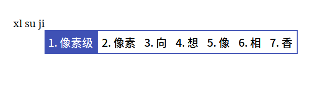
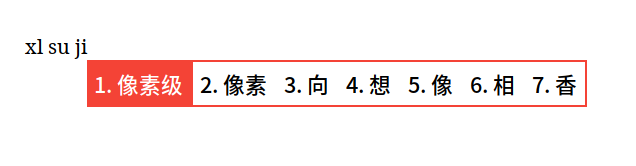
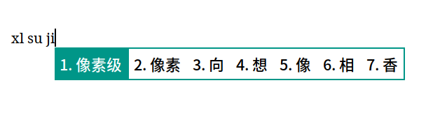
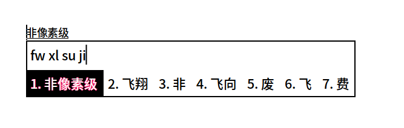
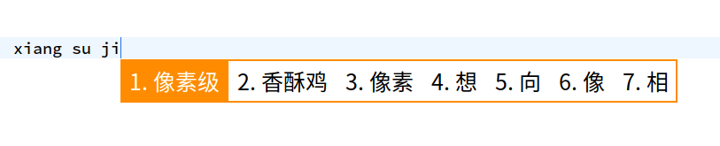
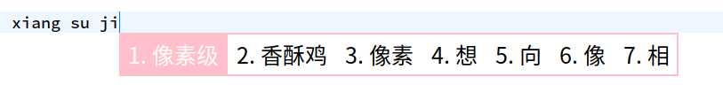

# Material-Color

一款使用 Material Design 配色的 fcitx5 皮肤，旨在模仿 Windows 10 自带输入法的 UI。

# 使用方式

## 安装

### 发行版包管理器

+ **Arch Linux**: `pacman -S fcitx5-material-color`
+ **[Debian](https://tracker.debian.org/pkg/fcitx5-material-color)**: `apt install fcitx5-material-color`

然后修改配置文件 `~/.config/fcitx5/conf/classicui.conf`：

```
# 垂直候选列表
Vertical Candidate List=False

# 按屏幕 DPI 使用
PerScreenDPI=True

# Font (设置成你喜欢的字体)
Font="思源黑体 CN Medium 13"

# 主题
Theme=Material-Color-Pink
```

根据颜色不同，使用以下主题名称：

+ Material-Color-Pink
+ Material-Color-Blue
+ Material-Color-Brown
+ Material-Color-DeepPurple
+ Material-Color-Indigo
+ Material-Color-Red
+ Material-Color-Teal
+ Material-Color-Black
+ Material-Color-Orange
+ Material-Color-SakuraPink

### 手动安装

```sh
mkdir -p ~/.local/share/fcitx5/themes/Material-Color
git clone https://github.com/hosxy/Fcitx5-Material-Color.git ~/.local/share/fcitx5/themes/Material-Color
```

**手动设置配色方案**

手动设置/切换配色方案需要使用命令行，比如将配色方案设置/切换为 blue：

```sh
cd ~/.local/share/fcitx5/themes/Material-Color
ln -sf ./theme-blue.conf theme.conf
```

+ **Tips 1**：第一次使用时必须设置一种配色方案（否则会打回原形）
+ **Tips 2**：设置/切换配色方案后需要重启输入法以生效

**启用主题**

修改配置文件 `~/.config/fcitx5/conf/classicui.conf`：

```
# 垂直候选列表
Vertical Candidate List=False

# 按屏幕 DPI 使用
PerScreenDPI=True

# Font (设置成你喜欢的字体)
Font="思源黑体 CN Medium 13"

# 主题
Theme=Material-Color
```

**更新**

想要更新这个皮肤很简单，打开一个终端，执行以下命令：

```sh
cd ~/.local/share/fcitx5/themes/Material-Color
git pull
```

## 单行模式 (inline preedit)

要使用单行模式，

+ 对于 fcitx5 自带的 pinyin，请修改 `~/.config/fcitx5/conf/pinyin.conf`
+ 对于 fcitx5-rime，请新建/修改 `~/.config/fcitx5/conf/rime.conf`

加入/修改以下内容：

```
# 可用时在应用程序中显示预编辑文本
PreeditInApplication=True
```

**注意**：修改配置文件 `~/.config/fcitx5/profile` 时，请务必退出 fcitx5 输入法，否则会因为输入法退出时会覆盖配置文件导致之前的修改被覆盖；修改其他配置文件可以不用退出 fcitx5 输入法，重启生效。

# 截图

## 双行模式


## 漂亮的单行模式

### pink



### blue



### brown



### deep purple



### indigo



### red



### teal



### black



### orange



### sakuraPink




# 备注

1. 使用 xim 的程序（非 GTK 非 Qt 程序）中无法使用单行模式，如 xterm, alacritty…
2. 较新版本 fcitx5 默认禁用了 gvim 的单行模式，若需启用，只需将环境变量 `FCITX_NO_PREEDIT_APPS` 设置为空即可。
